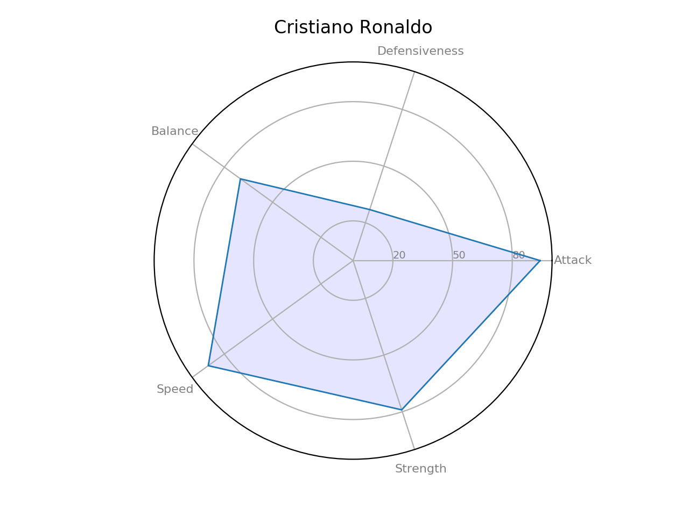

# soccerdatawithpandas

This is my data analysis/visualization project from a soccer player data set from [Kaggle](https://www.kaggle.com/simrat1193/make-your-soccer-club-and-find-similar-players/data)

I attempt to look into this data and plot relevant graphs

### Plot Age and Weight on a graph
main.py purpose of finding correlation amongst factors such as weight, height, age.

### Plot Weight, Age, Height, etc of each player on a radar chart 

Start handling big dataset of soccer players
radarchart.py serving the purpose of making a chart of players'ability and compatibility. 
How to run radarchart.py: 
1. Take a look at the data.csv file
2. Find out the name of player who you want to see the radar chart
3. Find out his ID
4. The program will ask you to enter his ID in a question prompted 
5. Jot downthe ID and you will see the radarchart by matpotlib

