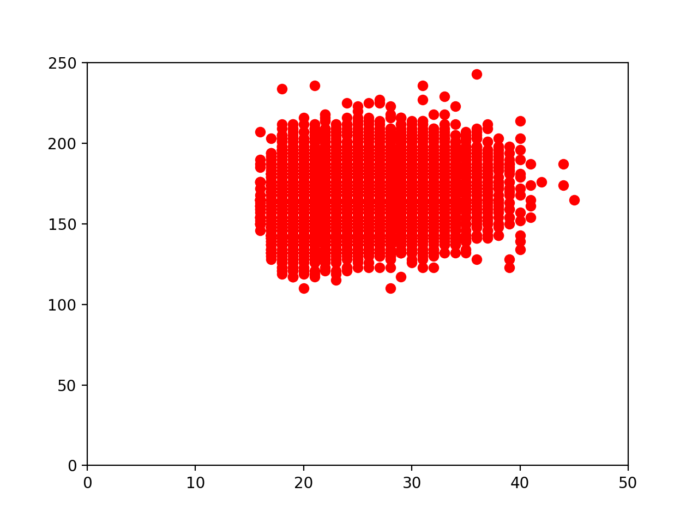
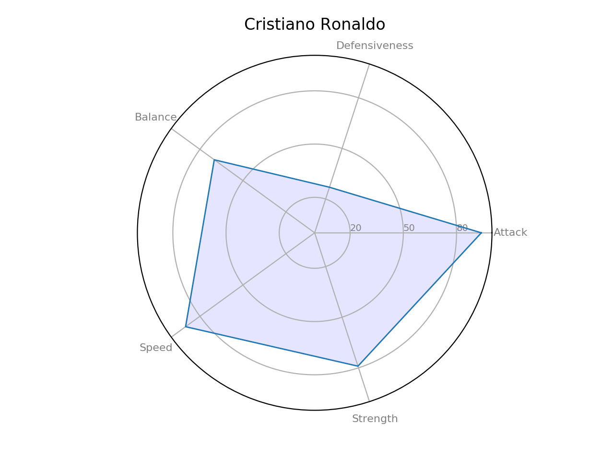

# soccerdatawithpandas
start handling big dataset of soccer players
main.py purpose of finding correlation amongst factors such as weight, height, age.

radarchart.py serving the purpose of making a chart of players'ability and compatibility. 

How to run radarchart.py: 
    - Take a look at the data.csv file
    - Find out the name of player who you want to see the radar chart
    - Find out his ID
    - The program will ask you to enter his ID in a question prompted 
    - Jot downthe ID and you will see the radarchart by matpotlib

